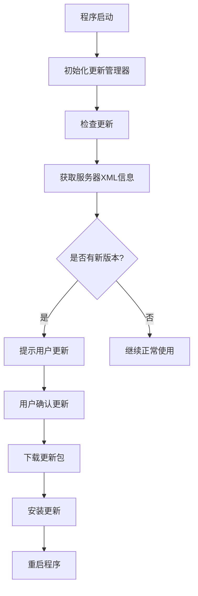

# Python桌面程序自动升级功能技术文档

## 1. 技术架构概述

本自动升级功能基于客户端-服务器架构设计，采用HTTP协议进行通信。主要由以下几个核心组件构成：

### 1.1 核心组件

1. **UpdateManager（更新管理器）**：负责整个升级流程的控制和执行
2. **ConfigManager（配置管理器）**：管理程序的配置信息，包括更新配置
3. **XML配置文件**：存储版本信息和更新包下载地址
4. **Web服务器**：提供更新信息和更新包的下载服务

### 1.2 技术栈

- Python标准库：requests（网络请求）、xml.etree.ElementTree（XML解析）、zipfile（ZIP解压）
- 第三方库：无特殊依赖
- 系统库：subprocess（进程管理）、tempfile（临时文件处理）、shutil（文件操作）

## 2. 工作流程

### 2.1 整体流程



### 2.2 详细步骤

1. **初始化阶段**
   - 程序启动时加载[update_config.json](file:///d:/Trae/WordFormatter/update_config.json)配置文件
   - 初始化[UpdateManager](file:///d:/Trae/WordFormatter/modules/update_manager.py#L11-L390)实例，读取当前版本号和更新检查URL

2. **检查更新阶段**
   - 向配置的URL发送HTTP GET请求获取update.xml文件
   - 解析XML文件提取版本号、更新说明和下载URL
   - 比较服务器版本与本地版本

3. **下载更新阶段**
   - 用户确认更新后，开始下载更新包
   - 显示下载进度
   - 将更新包保存到系统临时目录

4. **安装更新阶段**
   - 根据更新包类型（.exe或.zip）执行不同安装逻辑
   - 对于.exe文件：创建批处理脚本执行更新
   - 对于.zip文件：解压并替换文件
   - 重启应用程序

## 3. 核心组件详解

### 3.1 UpdateManager类

#### 主要方法：

1. **`check_for_updates()`**：检查是否有可用更新
   - 发送HTTP请求获取更新信息
   - 解析XML格式的更新信息
   - 比较版本号判断是否需要更新

2. **`download_update(release_info)`**：下载更新包
   - 支持.exe和.zip两种格式
   - 显示下载进度
   - 返回下载文件路径

3. **`install_update(update_file_path)`**：安装更新
   - 根据文件类型调用相应的安装方法
   - 安装完成后退出当前程序

4. **`_install_zip_update(update_file_path)`**：安装ZIP格式更新包
   - 区分开发环境和生产环境
   - 解压文件并替换现有文件
   - 重启应用程序

### 3.2 配置管理

#### 配置文件：
1. **[update_config.json](file:///d:/Trae/WordFormatter/update_config.json)**：程序启动时加载的更新配置
   ```json
   {
       "auto_update": true,
       "update_check_url": "https://example.com/update.xml"
   }
   ```

2. **update.xml**：服务器端版本信息文件
   ```xml
   <update>
       <version>1.1.2</version>
       <url>https://example.com/app_V1.1.2.zip</url>
       <notes>更新说明</notes>
   </update>
   ```

## 4. 关键技术点

### 4.1 版本号比较算法

采用分段比较法：
1. 将版本号按`.`分割成数组
2. 逐位比较各段数字
3. 支持不同长度版本号的比较

```python
def _is_newer_version(self, latest, current):
    latest_parts = list(map(int, latest.split('.')))
    current_parts = list(map(int, current.split('.'))
    # 确保版本号部分长度一致
    max_length = max(len(latest_parts), len(current_parts))
    latest_parts += [0] * (max_length - len(latest_parts))
    current_parts += [0] * (max_length - len(current_parts))
    # 逐位比较版本号
    for latest_part, current_part in zip(latest_parts, current_parts):
        if latest_part > current_part:
            return True
        elif latest_part < current_part:
            return False
    return False
```

### 4.2 跨平台兼容性处理

1. **开发环境与生产环境区分**：
   - 通过`sys.frozen`属性判断是否为打包后的exe文件
   - 分别处理开发环境(.py文件)和生产环境(.exe文件)的更新流程

2. **文件路径处理**：
   - 使用`os.path`模块处理跨平台路径问题
   - 利用[tempfile](file:///C:/Users/Trae/AppData/Local/Programs/Python/Python39/Lib/tempfile.py)模块获取系统临时目录

### 4.3 权限处理

1. **文件替换**：
   - 使用批处理脚本处理exe文件更新，避免权限问题
   - 延迟执行文件替换，在程序退出后执行

2. **UAC提权**：
   - 使用Windows API `ShellExecuteW`以管理员权限运行更新脚本

### 4.4 错误处理与日志记录

1. **网络异常处理**：
   - 设置请求超时时间
   - 捕获各种网络异常并给出友好提示

2. **文件操作异常处理**：
   - 文件读写异常捕获
   - 解压过程异常处理

3. **日志记录**：
   - 使用Python logging模块记录详细日志
   - 提供用户界面日志输出回调函数

## 5. 注意事项与最佳实践

### 5.1 安全性考虑

1. **SSL证书验证**：
   - 在生产环境中应启用SSL验证
   - 示例代码中为方便测试设置了`verify=False`，实际使用中应移除

2. **更新包完整性校验**：
   - 建议增加MD5或SHA256校验机制
   - 防止更新包被篡改

### 5.2 性能优化

1. **下载优化**：
   - 使用流式下载避免内存占用过高
   - 设置合适的chunk_size提高下载效率

2. **版本检查频率**：
   - 当前实现为启动时检查一次
   - 可扩展为定期后台检查

### 5.3 兼容性处理

1. **文件锁定问题**：
   - 更新正在运行的exe文件需要特殊处理
   - 使用外部批处理脚本解决文件锁定问题

2. **路径编码问题**：
   - 设置正确的字符编码避免中文乱码
   - 在批处理脚本中使用`chcp 65001`设置UTF-8编码

### 5.4 用户体验优化

1. **进度反馈**：
   - 提供下载进度显示
   - 清晰的操作提示信息

2. **异常恢复**：
   - 更新失败后的回滚机制
   - 保留更新前的备份文件

## 6. 部署与维护

### 6.1 服务器端部署

1. **XML文件维护**：
   - 及时更新版本号和下载链接
   - 确保XML格式正确

2. **更新包管理**：
   - 按照约定命名规则打包更新文件
   - 确保Web服务器正常运行

### 6.2 客户端配置

1. **配置文件分发**：
   - [update_config.json](file:///d:/Trae/WordFormatter/update_config.json)应随程序一起分发
   - 可通过服务器动态下发配置

2. **版本管理**：
   - 在[UpdateManager](file:///d:/Trae/WordFormatter/modules/update_manager.py#L11-L390)中维护正确的当前版本号
   - 确保版本号格式符合比较算法要求

## 7. 扩展建议

1. **增量更新**：
   - 实现差分更新减少下载量
   - 使用二进制差异算法

2. **静默更新**：
   - 实现后台自动下载和安装
   - 减少对用户的打扰

3. **更新策略配置**：
   - 提供多种更新策略选择（提醒更新、自动更新等）
   - 支持用户自定义更新偏好

4. **多渠道更新**：
   - 支持从不同源获取更新（官网、CDN、内网服务器等）
   - 实现更新源切换功能